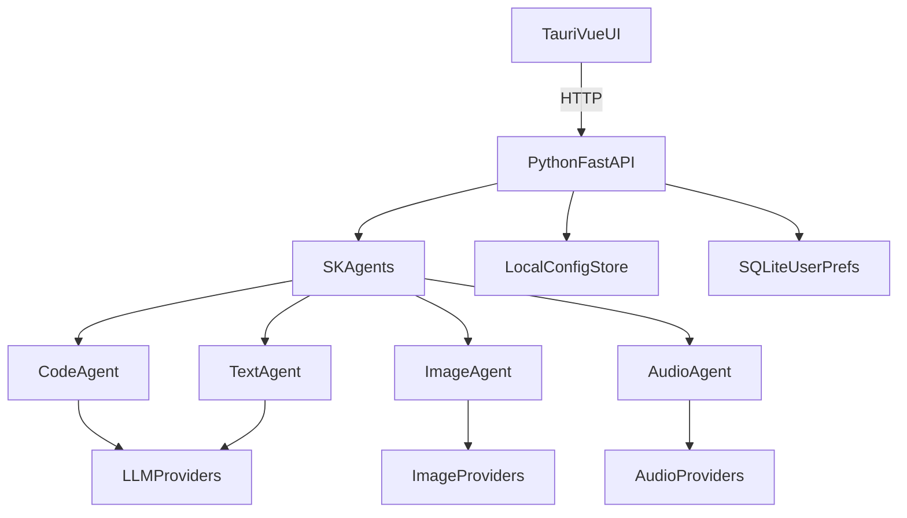

# Unity Generator MVP Plan

## Architecture Snapshot

## Target Folder Structure

- `[C:/Projects/Unity-Generator/frontend](C:/Projects/Unity-Generator/frontend)`
  - Tauri + Vue UI, settings, generation panels
- `[C:/Projects/Unity-Generator/backend](C:/Projects/Unity-Generator/backend)`
  - Python FastAPI + Semantic Kernel orchestration
- `[C:/Projects/Unity-Generator/config](C:/Projects/Unity-Generator/config)`
  - Local config files for API keys (encrypted store / JSON)
- `[C:/Projects/Unity-Generator/agents](C:/Projects/Unity-Generator/agents)`
  - Modular SK agents: code/text/image/audio
- `[C:/Projects/Unity-Generator/services](C:/Projects/Unity-Generator/services)`
  - Provider wrappers for LLM/image/audio
- `[C:/Projects/Unity-Generator/db](C:/Projects/Unity-Generator/db)`
  - SQLite database for user preferences

## Implementation Plan

1. **Scaffold project structure**
  - Create the folders listed above and baseline README/docs.
  - Decide on config file format (JSON) plus optional encryption key in OS keychain.
2. **Backend MVP (FastAPI + SK)**
  - Initialize FastAPI app with `/health` and `/generate/*` endpoints.
  - Add Semantic Kernel setup with provider-agnostic interfaces.
  - Load API keys from `[config](C:/Projects/Unity-Generator/config)` and preferences from `[db](C:/Projects/Unity-Generator/db)`.
3. **Agent modules**
  - Implement `CodeAgent`, `TextAgent`, `ImageAgent`, `AudioAgent` in `[agents](C:/Projects/Unity-Generator/agents)`.
  - Each agent delegates to the appropriate provider wrapper in `[services](C:/Projects/Unity-Generator/services)`.
4. **Provider abstractions + selection strategy**
  - LLM adapter: DeepSeek/OpenAI/Groq/OpenRouter (simple REST).
  - Image adapter: Stability or Flux API.
  - Audio adapter: ElevenLabs or PlayHT.
  - Provider selection policy (priority order + per-agent choice in settings).
5. **Frontend MVP (Tauri + Vue)**
  - Settings page to store API keys locally.
  - Four panels for code/text/image/audio generation.
  - Calls backend HTTP endpoints with clear error states.
6. **Local storage + SQLite**
  - Store API keys locally (tauri-plugin-store) and sync minimal prefs to SQLite via backend.
7. **Error handling, logging, testing**
  - Unified response format for all agents (success, date, error, data).
  - Backend logs + failed request logs; map to clear UI error states.
  - Add simple backend smoke tests and curl scripts.
  - Provide dev scripts for running frontend + backend without Docker.
8. **Cross-platform packaging**
  - Add Tauri build instructions for Windows/macOS/Linux.
  - Document install steps and runtime dependencies.

## MVP Todos

- `scaffold-structure`: Create folders and base project files.
- `backend-mvp`: FastAPI + Semantic Kernel bootstrap.
- `agents-wrappers`: Implement agents + provider wrappers.
- `frontend-mvp`: Tauri + Vue UI with settings and panels.
- `storage-sqlite`: API key storage + SQLite prefs.
- `testing-docs`: Add scripts and documentation.

