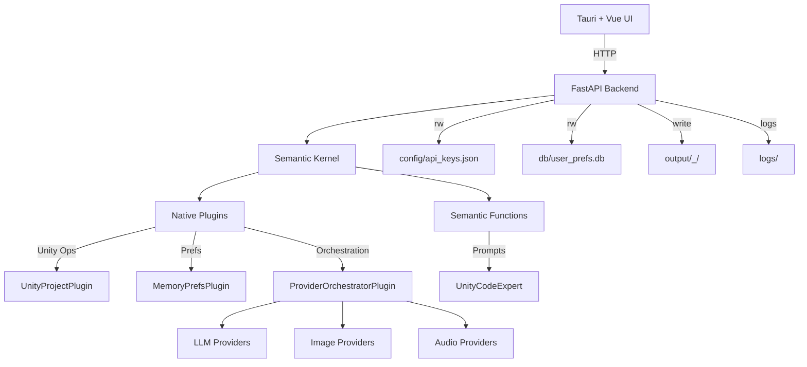

# Architecture Overview

Unity Generator is a local-first desktop application that pairs a Tauri + Vue UI
with a FastAPI backend. The backend orchestrates modular agents that call cloud
AI providers using user-supplied API keys.

## High-level components

- UI: Tauri desktop shell with a Vue frontend for prompts and settings.
- Backend API: FastAPI app that exposes generation endpoints and preferences.
- Semantic Kernel: Core orchestration engine that manages agents, native plugins, and semantic functions.
- Native Plugins: Python-based logic for system operations (UnityProjectPlugin, MemoryPrefsPlugin, ProviderOrchestratorPlugin).
- Semantic Functions: AI-driven content generation prompts (UnityCodeExpert).
- Storage: Local JSON for API keys and SQLite for user preferences.
- Output: Unity-ready project folders with metadata files.
- Incremental Saving: Assets can be saved directly into an active Unity project workspace via `asset_saver.py`.

## Request flow

1. UI collects prompts and provider settings.
2. UI calls backend endpoints over HTTP.
3. FastAPI routes to the correct agent via `AgentManager`.
4. Agents call provider wrappers with the active API key.
5. Provider responses are normalized into a common response shape.
6. For Unity project requests, assets are written to `output/`.

### Finalize flow (Unity Engine integration)

1. UI sends a `POST /api/v1/project/finalize` request with prompts and Unity
   Engine settings (toggles for scene generation, UPM packages, URP setup).
2. Backend creates an async job and returns a `job_id` immediately.
3. A background thread scaffolds the project, renders Jinja2 C# templates, and
   injects them into `Assets/Editor/AutoGenerated/`.
4. Unity is launched in `-batchmode -nographics -quit` mode with
   `-executeMethod AutoGenerated.ProjectInitializer.Setup`.
5. On exit, `Editor.log` is parsed for errors/warnings. Injected scripts are
   cleaned up in a `finally` block.
6. The project is zipped for download. The UI polls
   `GET /api/v1/project/finalize/{job_id}` for real-time progress and logs.

## Backend modules

- `app/main.py`: FastAPI routes, request validation, and error handling.
- `app/schemas.py`: Pydantic request/response models.
- `app/agent_manager.py`: Agent wiring and runtime selection.
- `services/*_provider.py`: API client logic and provider selection.
- `services/unity_orchestrator.py`: Unity Engine batch-mode orchestrator
  (script injection, subprocess management, log parsing, zip).
- `app/unity_project.py`: Unity project scaffolding and asset writing.
- `app/finalize_store.py`: In-memory job store for async finalize workflows.
- `app/db.py`: SQLite preferences DB (`user_prefs.db`).
- `app/config.py`: Repo-local paths, API key load/save, Unity Editor path
  resolution.
- `app/asset_saver.py`: Utility for saving individual assets (Code, Text, Image, Audio) and generating `.meta` files for Unity compatibility.

## Provider selection

Providers are selected with a simple priority fallback when the request does not
specify a provider. Priority is defined in each provider module:

- LLM: `deepseek`, `openrouter`, `openai`, `groq`
- Image: `stability`, `flux`
- Audio: `elevenlabs`, `playht`

The selected provider is based on preference keys in the SQLite DB and available
API keys in `config/api_keys.json`.

## Storage and data locations

- API keys: `config/api_keys.json` (local file, not committed)
- Preferences: `db/user_prefs.db` (SQLite)
- Logs: `logs/` (rotated by Python logging config)
- Generated output: `output/<ProjectName>_<timestamp>/`

## Unity output layout

The Unity project scaffold includes:

- `Assets/Scripts/*.cs`
- `Assets/Text/*.txt`
- `Assets/Sprites/*.png`
- `Assets/Audio/*.mp3`
- `ProjectSettings/ProjectVersion.txt`
- Unity `.meta` files for all assets and folders

The output is designed so Unity can open the folder immediately without manual
setup.

## Error handling and observability

- Each endpoint wraps generation calls and returns a consistent response shape.
- Failures are logged to a dedicated logger for failed requests.
- Backend logs are written under `logs/`.
- **Quality Control**: The system enforces `pnpm check:all` (Linting, Typechecking, Testing) across the entire stack.

## Security model

- API keys are stored locally and never sent to third-party services except the
  intended provider.
- No keys are bundled with the application.
- Keys are surfaced in the UI as masked values from the backend.

## Extension points

- Add a provider by extending `services/*_provider.py` and its key map.
- Add an agent by extending `agents/` and wiring it in `AgentManager`.
- Add a new endpoint by creating a request model in `schemas.py` and a route in
  `main.py`.
- Add a Unity automation step by creating a new Jinja2 template in
  `backend/templates/unity/` and wiring it in the orchestrator.
- See [UNITY_INTEGRATION.md](UNITY_INTEGRATION.md) for full details on the
  finalize workflow and Unity Engine integration.
