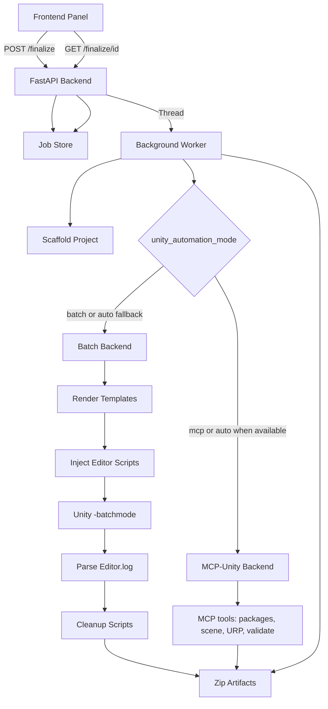

# Unity Engine Integration

This document describes the Unity Engine integration layer that allows the
Unity Generator to run project finalization tasks (scene creation, UPM package
installation, project settings automation, asset import validation) either via
**batch mode** (injected Editor scripts and `-executeMethod`) or via the
**MCP-Unity plugin** (live Editor automation). Batch mode is used for CI/headless;
MCP mode is used when a Unity Editor is running and the plugin is configured.

## Prerequisites

- **Unity Editor** 2021.3 LTS or newer (2022.3 LTS recommended).
- Unity must be installed and accessible from the host machine.
- A valid Unity license must be activated (Personal, Plus, or Pro).
- The Unity Editor path must be resolvable (see Configuration below).

### Platform-specific notes

| Platform | Default search paths |
|----------|---------------------|
| Windows  | `C:\Program Files\Unity\Hub\Editor\*\Editor\Unity.exe` |
| macOS    | `/Applications/Unity/Hub/Editor/*/Unity.app/Contents/MacOS/Unity` |
| Linux    | `/opt/unity/editor/*/Editor/Unity`, `~/Unity/Hub/Editor/*/Editor/Unity` |

## Configuration

The Unity Editor path is resolved with the following precedence:

1. **Request override**: The `unity_editor_path` field in `unity_settings`.
2. **Environment variable**: `UNITY_EDITOR_PATH` (recommended for CI/Docker).
3. **User preference**: `unity_editor_path` key in the SQLite preferences DB
   (configurable via the Settings panel or API).
4. **Auto-discovery**: Searches well-known install locations for the newest
   version.

### Setting the environment variable

```powershell
# Windows (PowerShell)
$env:UNITY_EDITOR_PATH = "C:\Program Files\Unity\Hub\Editor\2022.3.0f1\Editor\Unity.exe"

# Linux / macOS
export UNITY_EDITOR_PATH="/Applications/Unity/Hub/Editor/2022.3.0f1/Unity.app/Contents/MacOS/Unity"
```

### Setting via the API

```bash
curl -X POST http://127.0.0.1:35421/prefs \
  -H "Content-Type: application/json" \
  -d '{"key": "unity_editor_path", "value": "/path/to/Unity"}'
```

## Finalize Workflow

The finalize workflow is an asynchronous job. Automation can run in two ways:

- **Batch mode** (default when MCP is not available): render and inject Editor scripts, run Unity in batch mode with `-executeMethod`, parse logs, cleanup scripts, then zip.
- **MCP mode** (when the MCP-Unity plugin is configured): call MCP-Unity tools for packages, scene, URP, and validation; no script injection; then zip.

Flow:

```
FinalizeRequest
  -> Scaffold base project (if needed)
  -> Choose backend: batch or MCP (from unity_automation_mode)
  -> Batch: render & inject scripts -> Unity -batchmode -> cleanup
  -> MCP:  call MCP-Unity tools (install_packages, create_scene, configure_urp, validate_import)
  -> Zip project for download
  -> Job completed / Job failed with diagnostics
```

### API Endpoints

| Method | Path | Description |
|--------|------|-------------|
| `POST` | `/api/v1/project/finalize` | Create a finalize job (async). Returns `job_id`. |
| `GET`  | `/api/v1/project/finalize/{job_id}` | Poll job status, progress, and logs. |
| `GET`  | `/api/v1/project/finalize/{job_id}/download` | Download the zipped project. |

### Request Example

```json
{
  "project_name": "MyGame",
  "code_prompt": "Create a player controller with WASD movement",
  "unity_settings": {
    "install_packages": true,
    "packages": ["com.unity.textmeshpro", "com.unity.render-pipelines.universal"],
    "generate_scene": true,
    "scene_name": "MainScene",
    "setup_urp": true,
    "timeout": 300,
    "unity_automation_mode": "auto"
  }
}
```

### Polling Response Example

```json
{
  "job_id": "a1b2c3d4e5f6",
  "status": "running",
  "step": "unity_run",
  "progress": 50,
  "logs_tail": [
    "[render] Rendering Editor automation scripts...",
    "[inject] Injecting Editor scripts into project...",
    "[unity_run] Launching Unity in batch mode..."
  ],
  "errors": [],
  "started_at": "2026-02-10T12:00:00Z",
  "finished_at": null,
  "project_path": "C:/Projects/Unity-Generator/output/MyGame_20260210_120000",
  "zip_path": null
}
```

## Unity Engine Settings (Toggles)

| Toggle | Description |
|--------|-------------|
| **Generate Default Scene** | Creates a scene with a camera, light, and ground plane. Saves as `Assets/Scenes/<name>.unity`. Also creates a ground prefab. |
| **Auto-Install UPM Packages** | Installs the specified UPM packages via `UnityEditor.PackageManager.Client`. |
| **Setup URP** | Configures the project for Universal Render Pipeline: sets linear color space, custom tags/layers, and assigns the URP render pipeline asset. |
| **Unity automation mode** | `unity_automation_mode`: `"batch"` (always use script injection), `"mcp"` (always use MCP-Unity plugin), or `"auto"` (use MCP if available, else batch). Default `"auto"`. |

## Unity Automation Operations Inventory

The finalize workflow runs these discrete operations. Each is classified for **MCP-Unity** (live Editor) vs **batch-only** (headless/CI).

| Operation | Template / Entry | MCP-capable | Batch-only | Notes |
|-----------|------------------|-------------|------------|-------|
| Install UPM packages | `PackageSetup.cs.j2` / `PackageInstaller.InstallAll()` | Yes | Fallback | `PackageManager.Client.Add`; MCP can expose equivalent tool. |
| Generate default scene + prefab | `ScenePrefabSetup.cs.j2` / `SceneGenerator.CreateDefaultScene` | Yes | Fallback | EditorSceneManager, PrefabUtility; MCP can create scene/prefab. |
| Configure URP and project settings | `ProjectSettingsSetup.cs.j2` / `ProjectSettingsConfigurator.ConfigureURP` | Yes | Fallback | PlayerSettings, TagManager, GraphicsSettings; MCP can configure. |
| Validate imports and compilation | `ImportValidation.cs.j2` / `ImportValidator.ValidateAll` | Yes | Fallback | AssetDatabase.Refresh, CompilationPipeline; MCP can run validation. |
| Orchestration | `AutomatedSetup.cs.j2` / `ProjectInitializer.Setup` | N/A | N/A | In MCP mode the backend calls MCP tools in sequence; in batch mode this entrypoint runs the injected scripts. |

- **MCP-capable**: Can be performed by the MCP-Unity (Semantic Kernel) plugin when a Unity Editor is running; avoids injecting temporary scripts.
- **Batch-only**: Required when no Editor is available (CI, headless). All operations remain available via injected scripts and `-executeMethod` for that case.

## Injected Editor Scripts (Batch Mode)

During finalization in **batch mode**, temporary C# scripts are injected into
`Assets/Editor/AutoGenerated/`. They are compiled by Unity's Editor assembly
and executed via `-executeMethod`. They are removed after execution (success or
failure) in a `finally` block. In **MCP mode**, the backend uses the MCP-Unity plugin instead and does not inject these scripts.

### Templates

Templates are Jinja2 files in `backend/templates/unity/`:

| Template | Purpose |
|----------|---------|
| `AutomatedSetup.cs.j2` | Main entrypoint (`ProjectInitializer.Setup`). Orchestrates all sub-steps. |
| `PackageSetup.cs.j2` | Installs UPM packages via `PackageManager.Client`. |
| `ScenePrefabSetup.cs.j2` | Creates a default scene with camera, light, ground plane, and a prefab. |
| `ProjectSettingsSetup.cs.j2` | Configures tags, layers, and URP render pipeline asset. |
| `ImportValidation.cs.j2` | Refreshes AssetDatabase, compiles scripts, writes a validation result JSON. |

## MCP-Unity Plugin Contract

When running in **MCP mode**, the backend calls the MCP-Unity (Semantic Kernel) plugin tools instead of injecting batch scripts. The plugin is expected to target the **currently open Unity project** (project path is passed where the protocol supports it). Tool interface definitions:

| Tool | Inputs | Outputs | Idempotent | Error reporting |
|------|--------|---------|------------|-----------------|
| `unity_install_packages` | `project_path: string`, `packages: string[]` | `success: bool`, `installed: string[]`, `message?: string` | No (installs add or upgrade) | On failure: `success: false`, `message` with reason (e.g. package not found, network error). |
| `unity_create_default_scene` | `project_path: string`, `scene_name: string` | `success: bool`, `scene_path?: string`, `prefab_path?: string`, `message?: string` | Yes (overwrites scene if same name) | On failure: `success: false`, `message` with reason. |
| `unity_configure_urp` | `project_path: string` | `success: bool`, `message?: string` | Yes | On failure: `success: false`, `message` (e.g. no URP asset found). |
| `unity_validate_import` | `project_path: string` | `success: bool`, `error_count: int`, `warning_count: int`, `errors?: string[]`, `message?: string` | Yes | Compilation/import errors in `errors`; `success: false` if `error_count > 0`. |

- All tools assume the Unity Editor is running and the project is open (or can be opened by the plugin). The backend maps plugin failures into the same `FinalizeResult` / job status format as batch mode.
- Mode selection: request field `unity_automation_mode: "batch" | "mcp" | "auto"`. Default `"auto"`: use MCP when the plugin is available and configured, otherwise fall back to batch.

## MCP-Unity readiness checklist

Use this checklist to confirm the MCP-Unity plugin implements all required behaviors before relying on it as the primary path (no required feature missing on the MCP side).

**Tool: `unity_install_packages`**

- **Inputs:** `project_path`, `packages` (list of UPM package IDs, e.g. `com.unity.render-pipelines.universal`).
- **Behavior:** Install each package (equivalent to `PackageManager.Client.Add`); wait for completion; fail if any install fails.
- **Required:** Same package set and order as batch (batch installs sequentially). No extra parameters in the current app.

**Tool: `unity_create_default_scene`**

- **Inputs:** `project_path`, `scene_name` (name without extension).
- **Behavior:** Create default scene equivalent to `ScenePrefabSetup.cs.j2`: new empty scene; Main Camera (tag `MainCamera`, position (0, 1, -10), Skybox clear); Directional Light (rotation 50, -30, 0); Ground plane (Plane, scale 5,1,5). Save scene to `Assets/Scenes/{scene_name}.unity` (create `Assets/Scenes` if needed). Save ground as prefab to `Assets/Prefabs/Ground.prefab` (create `Assets/Prefabs` if needed).
- **Required:** Same paths and structure so generated projects behave like batch-generated ones.

**Tool: `unity_configure_urp`**

- **Inputs:** `project_path`.
- **Behavior:** Equivalent to `ProjectSettingsSetup.cs.j2`: set `PlayerSettings.colorSpace` to Linear; TagManager: add tags `Generated`, `AutoSetup`; set user layers 8 and 9 to `CustomLayer1`, `CustomLayer2`; find first `RenderPipelineAsset` in project, assign to `GraphicsSettings.defaultRenderPipeline` and `QualitySettings.renderPipeline`.
- **Required:** Same tags, layer names, and linear color space so URP setup matches batch.

**Tool: `unity_validate_import`**

- **Inputs:** `project_path`.
- **Behavior:** Equivalent to `ImportValidation.cs.j2`: full asset refresh, trigger script compilation, report compilation errors and warnings; return `success` when error count is 0.
- **Required:** Return structured result with `success`, `error_count`, `warning_count`, `errors` (and optionally `warnings`) so the backend can map to `FinalizeResult` / job status.

**Cross-cutting**

- **Timeout:** Batch path uses a single timeout (e.g. 300s) for the whole Unity process. MCP tools may run long (e.g. package install, full import). The MCP client or plugin should respect a timeout (per-tool or global) so the app can fail gracefully; the backend accepts `timeout` and passing it to MCP calls is recommended for parity.
- **Project path:** All tools receive `project_path`; the plugin must operate on that project (open it if necessary, or assume it is already open).

## Error Handling

The orchestrator parses the Unity `Editor.log` for known error signatures:

- `error CS####` compilation errors
- `Compilation failed:` messages
- `Fatal Error!` and `Crash!!!` signals
- `Aborting batchmode` messages

Non-zero exit codes automatically trigger failure status with parsed diagnostics.
The last 5000 characters of the Editor.log are included in the job status for
troubleshooting.

## Troubleshooting

| Problem | Solution |
|---------|----------|
| "Unity Editor not found" | Set `UNITY_EDITOR_PATH` or install Unity Hub |
| Job times out | Increase the `timeout` setting (default 300s) |
| Compilation errors | Check `logs_tail` in the status response for C# errors |
| "No URP asset found" | Ensure `com.unity.render-pipelines.universal` is in the packages list |
| Permission errors | Ensure the backend process has write access to the output directory |

## MCP-Unity Integration

- **Preferred path**: MCP-Unity is the **preferred** path when it is enabled; batch mode (Unity.exe + injected scripts) is the **fallback** when MCP is unavailable or when `unity_automation_mode` is `"batch"`.
- **When it is used**: When `unity_automation_mode` is `"mcp"` or when it is `"auto"` and the MCP-Unity plugin is enabled (see below). Otherwise the batch backend is used.
- **Enabling MCP**: Set the environment variable `UNITY_USE_MCP=1` (or `true` / `yes`) so that `"auto"` uses the MCP-Unity plugin when available. You must also configure how the backend reaches the server: **`UNITY_MCP_SERVER_URL`** (Streamable HTTP URL) or, by default, **stdio** by running the server as a subprocess (command from **`UNITY_MCP_COMMAND`**, default `unity-mcp`; optional **`UNITY_MCP_ARGS`** for extra arguments). The backend uses the official MCP Python SDK and calls the four contract tools (install_packages, create_default_scene, configure_urp, validate_import).
- **Readiness**: Before relying on MCP as primary, verify the plugin implements all required behaviors using the [MCP-Unity readiness checklist](#mcp-unity-readiness-checklist) above.
- **CI / headless**: Use `unity_automation_mode: "batch"` so that finalize always uses injected scripts and Unity batch mode; MCP-Unity is not required.

## Architecture Diagram


