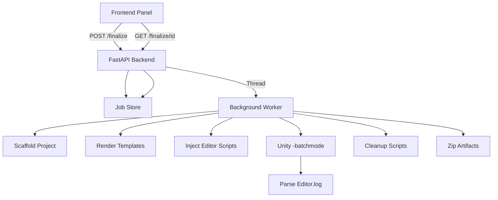

# Unity Engine Integration

This document describes the Unity Engine integration layer that allows the
Unity Generator to execute headless Unity in batch mode for project
finalization tasks such as scene creation, UPM package installation,
project settings automation, and asset import validation.

## Prerequisites

- **Unity Editor** 2021.3 LTS or newer (2022.3 LTS recommended).
- Unity must be installed and accessible from the host machine.
- A valid Unity license must be activated (Personal, Plus, or Pro).
- The Unity Editor path must be resolvable (see Configuration below).

### Platform-specific notes

| Platform | Default search paths |
|----------|---------------------|
| Windows  | `C:\Program Files\Unity\Hub\Editor\*\Editor\Unity.exe` |
| macOS    | `/Applications/Unity/Hub/Editor/*/Unity.app/Contents/MacOS/Unity` |
| Linux    | `/opt/unity/editor/*/Editor/Unity`, `~/Unity/Hub/Editor/*/Editor/Unity` |

## Configuration

The Unity Editor path is resolved with the following precedence:

1. **Request override**: The `unity_editor_path` field in `unity_settings`.
2. **Environment variable**: `UNITY_EDITOR_PATH` (recommended for CI/Docker).
3. **User preference**: `unity_editor_path` key in the SQLite preferences DB
   (configurable via the Settings panel or API).
4. **Auto-discovery**: Searches well-known install locations for the newest
   version.

### Setting the environment variable

```powershell
# Windows (PowerShell)
$env:UNITY_EDITOR_PATH = "C:\Program Files\Unity\Hub\Editor\2022.3.0f1\Editor\Unity.exe"

# Linux / macOS
export UNITY_EDITOR_PATH="/Applications/Unity/Hub/Editor/2022.3.0f1/Unity.app/Contents/MacOS/Unity"
```

### Setting via the API

```bash
curl -X POST http://127.0.0.1:8000/prefs \
  -H "Content-Type: application/json" \
  -d '{"key": "unity_editor_path", "value": "/path/to/Unity"}'
```

## Finalize Workflow

The finalize workflow is an asynchronous job that executes the following steps:

```
FinalizeRequest
  -> Scaffold base project (reuse existing scaffold logic)
  -> Render & inject Editor automation scripts
  -> Run Unity in batch mode (-executeMethod)
  -> Parse exit code and Editor.log
  -> Cleanup injected scripts
  -> Zip project for download
  -> Job completed / Job failed with diagnostics
```

### API Endpoints

| Method | Path | Description |
|--------|------|-------------|
| `POST` | `/api/v1/project/finalize` | Create a finalize job (async). Returns `job_id`. |
| `GET`  | `/api/v1/project/finalize/{job_id}` | Poll job status, progress, and logs. |
| `GET`  | `/api/v1/project/finalize/{job_id}/download` | Download the zipped project. |

### Request Example

```json
{
  "project_name": "MyGame",
  "code_prompt": "Create a player controller with WASD movement",
  "unity_settings": {
    "install_packages": true,
    "packages": ["com.unity.textmeshpro", "com.unity.render-pipelines.universal"],
    "generate_scene": true,
    "scene_name": "MainScene",
    "setup_urp": true,
    "timeout": 300
  }
}
```

### Polling Response Example

```json
{
  "job_id": "a1b2c3d4e5f6",
  "status": "running",
  "step": "unity_run",
  "progress": 50,
  "logs_tail": [
    "[render] Rendering Editor automation scripts...",
    "[inject] Injecting Editor scripts into project...",
    "[unity_run] Launching Unity in batch mode..."
  ],
  "errors": [],
  "started_at": "2026-02-10T12:00:00Z",
  "finished_at": null,
  "project_path": "C:/Projects/Unity-Generator/output/MyGame_20260210_120000",
  "zip_path": null
}
```

## Unity Engine Settings (Toggles)

| Toggle | Description |
|--------|-------------|
| **Generate Default Scene** | Creates a scene with a camera, light, and ground plane. Saves as `Assets/Scenes/<name>.unity`. Also creates a ground prefab. |
| **Auto-Install UPM Packages** | Installs the specified UPM packages via `UnityEditor.PackageManager.Client`. |
| **Setup URP** | Configures the project for Universal Render Pipeline: sets linear color space, custom tags/layers, and assigns the URP render pipeline asset. |

## Injected Editor Scripts

During finalization, temporary C# scripts are injected into
`Assets/Editor/AutoGenerated/`. These are compiled by Unity's Editor assembly
and executed via `-executeMethod`. They are removed after execution (success or
failure) in a `finally` block.

### Templates

Templates are Jinja2 files in `backend/templates/unity/`:

| Template | Purpose |
|----------|---------|
| `AutomatedSetup.cs.j2` | Main entrypoint (`ProjectInitializer.Setup`). Orchestrates all sub-steps. |
| `PackageSetup.cs.j2` | Installs UPM packages via `PackageManager.Client`. |
| `ScenePrefabSetup.cs.j2` | Creates a default scene with camera, light, ground plane, and a prefab. |
| `ProjectSettingsSetup.cs.j2` | Configures tags, layers, and URP render pipeline asset. |
| `ImportValidation.cs.j2` | Refreshes AssetDatabase, compiles scripts, writes a validation result JSON. |

## Error Handling

The orchestrator parses the Unity `Editor.log` for known error signatures:

- `error CS####` compilation errors
- `Compilation failed:` messages
- `Fatal Error!` and `Crash!!!` signals
- `Aborting batchmode` messages

Non-zero exit codes automatically trigger failure status with parsed diagnostics.
The last 5000 characters of the Editor.log are included in the job status for
troubleshooting.

## Troubleshooting

| Problem | Solution |
|---------|----------|
| "Unity Editor not found" | Set `UNITY_EDITOR_PATH` or install Unity Hub |
| Job times out | Increase the `timeout` setting (default 300s) |
| Compilation errors | Check `logs_tail` in the status response for C# errors |
| "No URP asset found" | Ensure `com.unity.render-pipelines.universal` is in the packages list |
| Permission errors | Ensure the backend process has write access to the output directory |

## Architecture Diagram


